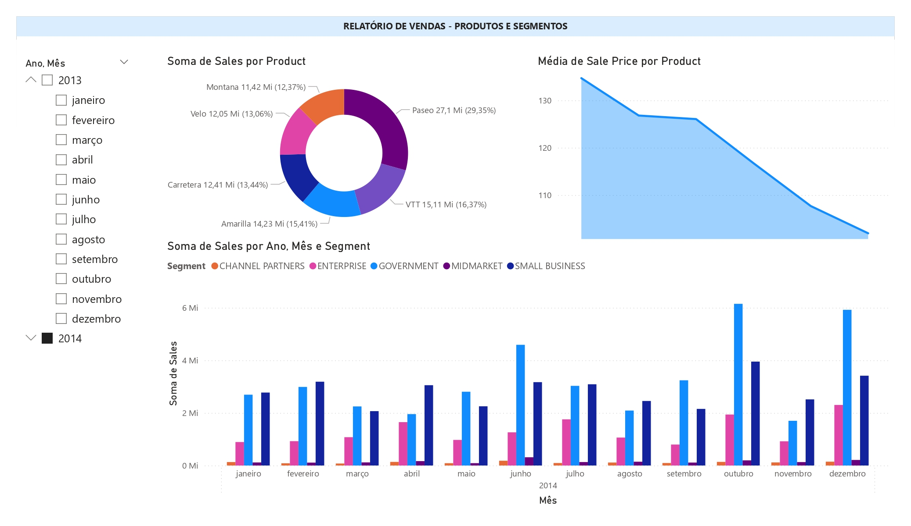
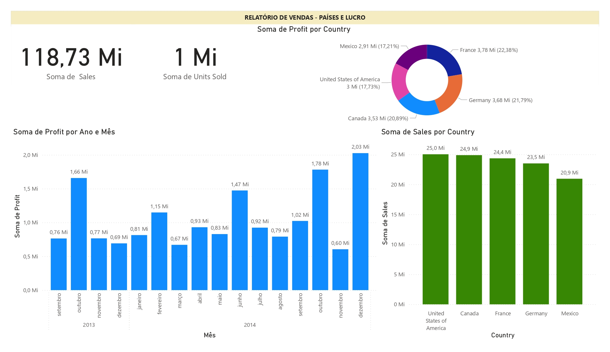
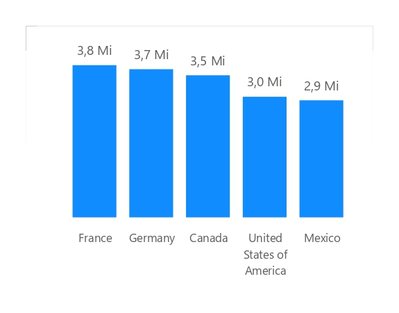
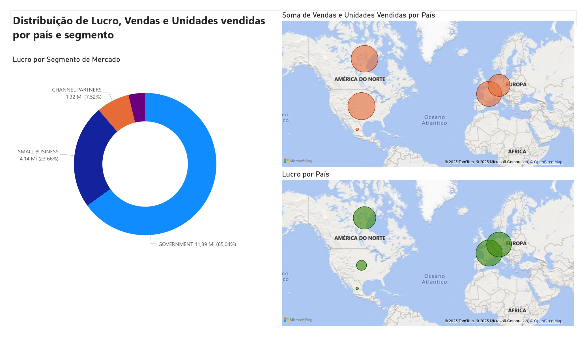

# power_bi_analyst2
# Desafio Bootcamp DIO - SQL Analytics e Power BI

Este projeto faz parte do Bootcamp da DIO, com foco em análise de dados utilizando SQL Analytics e Power BI.

### Objetivos:
- Prática de ETL (Extract, Transform, Load)
- Importação e transformação de dados
- Criação de relatórios e gráficos no Power BI

### Conteúdo:
Demonstração guiada por **Juliana Zanelatto**, com overview prático do uso do Power BI para análise de dados.

### Relatórios:

Página 1  

Página 2  

Página 3  

Página 4  

